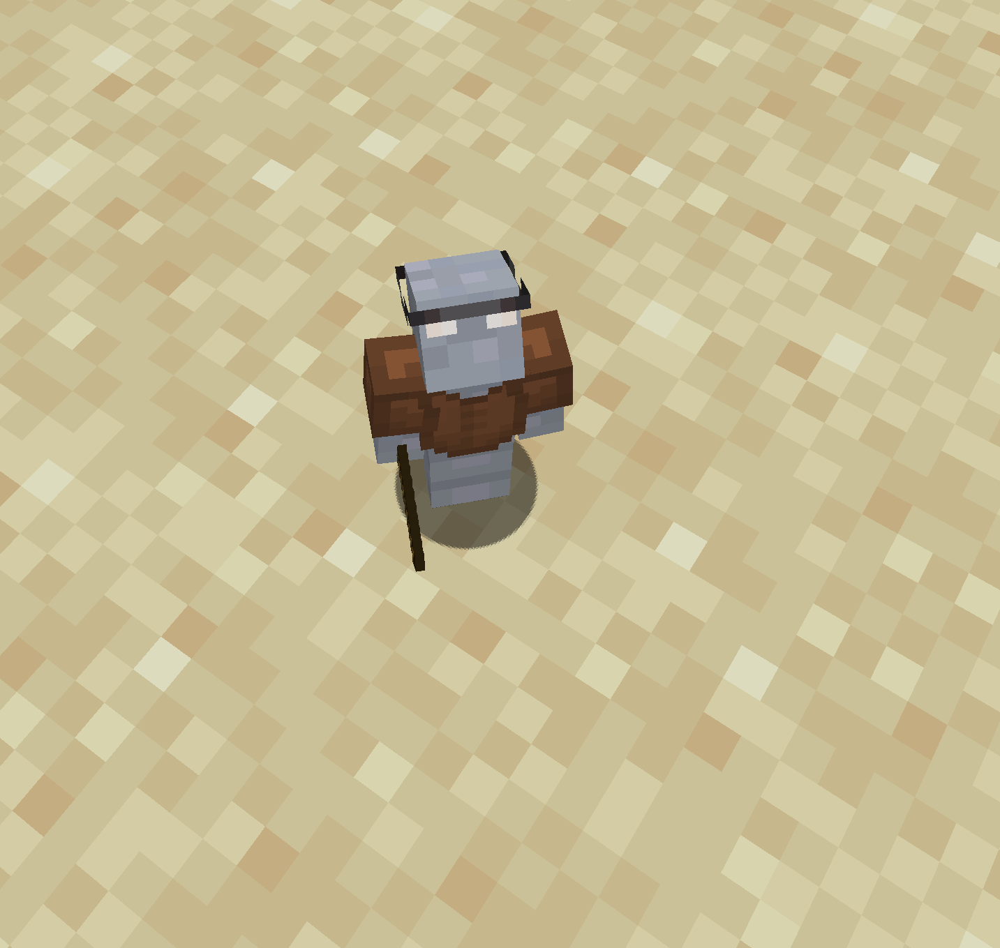
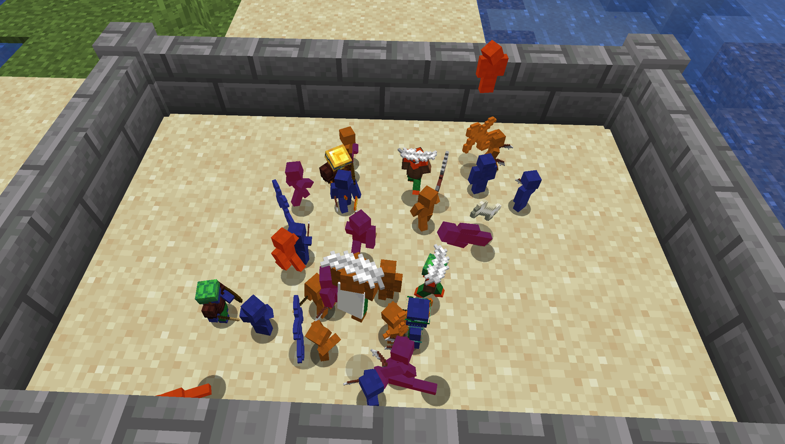
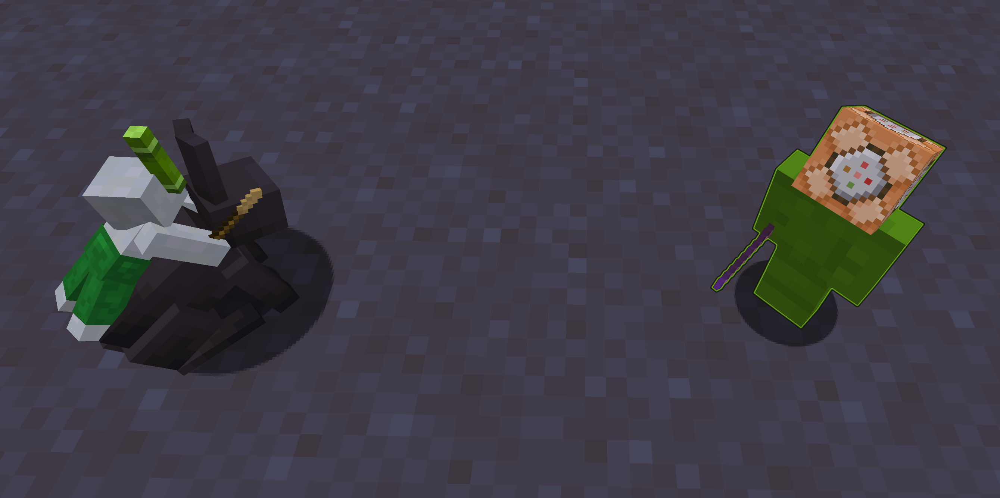
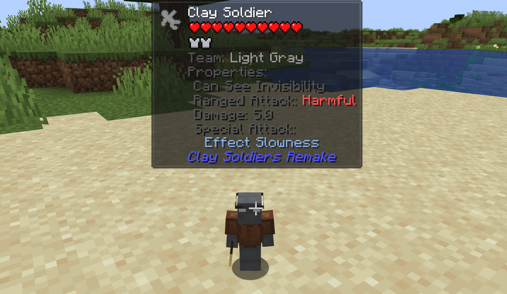

# Getting Started

Welcome to Clay Soldiers Remake! This guide will help you quickly understand the basics of the mod,
from crafting your first clay soldiers to setting up epic battles. Let’s dive right in!

## 1. Crafting your First Clay Soldier

Your journey begins by crafting your first army of tiny warriors! Here’s how you can craft clay soldiers:

::: details Recipe
<recipe-crafting
slot_2 = "clay_ball"
slot_5 = "soul_sand"
result="clay_soldier" amount="4"/>
:::

Additionally, you can dye your Clay Soldier in different colors

::: details Dye Recipe
<SoldierRecipe/>
:::

## 2. Equipping Your Clay Soldiers

Once you have your clay soldiers,
you can arm and equip them with various items by throwing them on the ground nearby.
Your soldiers will automatically pick up items and enhance their abilities based on what they collect.

**Some Basic Equipment**

* Weapons: Throw sticks, blaze rod or bones to arm your soldiers with melee weapons
* Armor: Soldiers can pick up leather or bricks to improve their defense.
* Mounts: You can give them mounts such as [Clay Horse](wiki/items/clay-horses.md) for faster movement.

The soldier is equipped with a stick as a weapon,
wearing leather armor for protection,
and has a glass pane as makeshift glasses

::: info 
All available items that Soldiers can hold are accessible in-game through the Creative Tab labeled `Clay Soldier Items`.
For a complete overview and a detailed description of each item, visit the [Default Items Guide](./wiki/default-items.md).
:::

## 3. Creating Your First Battle

Now that your soldiers are armed and ready, it’s time for battle!

1. Choose a Battlefield: Set up a small arena using blocks.
It can be as simple or complex as you like. Flat spaces work best.

2. Deploy Your Soldiers: Right-click the ground to place your soldiers on the battlefield.
You can deploy multiple teams by crafting soldiers of different colors.

3. Let the Battle Begin: Once soldiers of opposing colors are nearby,
they will automatically start fighting each other. Sit back and watch the battle unfold!

## 4. Expanding Your Clay Soldier Experience

You can customize your soldiers even more by using datapacks to add new items they can hold or wear. Check out the [Custom Items Guide](./create-items/) for details on how to create your own items and integrate them into the mod.
Advanced Battles

## 5. Some useful tips

* You can view all the items that soldiers can hold, wear, or interact with by checking the Creative Tab labeled `Clay Soldier Items`. This will give you a full list of available equipment for your army.

* While hovering over any soldier item, hold `Alt` to see a detailed breakdown of its stats.

* If you have [Jade](https://jademc.readthedocs.io/en/latest/) installed, you’ll be able to see additional stats for Clay Soldiers.
    

