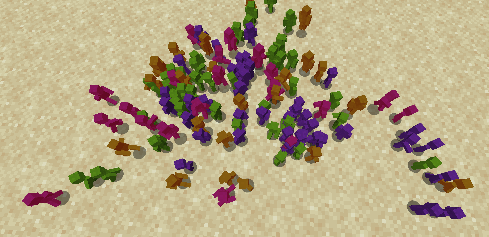
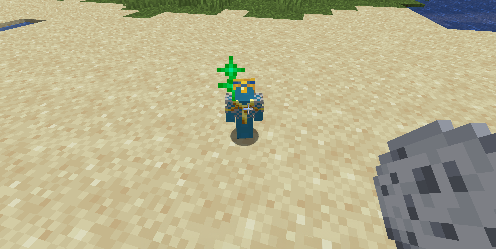
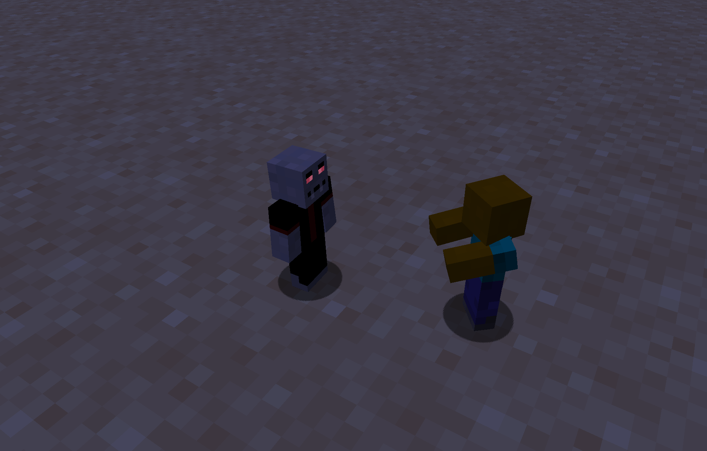
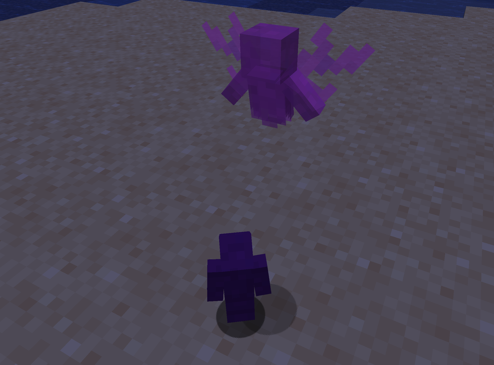

# Clay Soldiers

Clay Soldiers are small, team-based creatures that can be peaceful.
When they encounter a soldier from a different team (identified by color), they will engage in combat automatically.

Clay Soldiers can be spawned using the [Clay Soldier Puppet](./items/soldier-puppet.md).

## Behavior Types

Clay Soldiers exhibit different behavior patterns depending on their role and how they are equipped.

| Name        | Description                                                      |
|-------------|------------------------------------------------------------------|
| `Normal`    | This is normal attack behaviour of soldiers. Nothing special.    |
| `Pacifist`  | Soldier doesn't attack. However they can do [work](work.md) now. |
| `Agressive` | Soldier attacks everyone, even team members                      |
| `Support`   | Can’t attack, but helps allied                                   |
| `King`      | Commands other soldiers to attack the same target.               |
| `Queen`     | Other soldiers will try to protect the Queen.                    |
| `Zombie`    | Behaves like a zombie                                            |
| `Vampire`   | Behaves like a vampire                                           |

## Gaining Loyalty from a Team

You can earn the loyalty of an entire team of soldiers, but only one team at a time can be loyal to you.
To gain their loyalty, feed a [Clay Cookie](./items/clay-cookie.md) to a `King` or `Queen` soldier.

Once loyal, the soldiers will:

* **Follow your commands:** Use a [Clay Brush](./items/clay-brush.md) to direct them.
* **Defend you:** They will attack any enemy you target
* **Perform tasks:** You can command them to guard areas or even [work](work.md) for you.

## Soldier Variants

In addition to the basic Clay Soldiers, there are unique variants that come with special behaviors and traits:

### Zombie Soldier

Zombie Soldiers act like regular Clay Soldiers but with a few key differences:
* **Burns in sunlight:** Similar to Minecraft zombies, they take damage from sunlight.
* **No new items:** They cannot pick up new items once spawned.
* **Cureable:** Some zombie soldiers can be cured, reverting them back to their original form.

### Vampire Soldier

The Vampire Soldier behaves in most aspects like a normal Clay Soldier:
* **Burns in sunlight:** Like zombies, they burn in the sun.
* **Alpha Vampires:** can convert other Soldiers they kill into a vampire. Vampires spawned this way are never alphas.

Undead soldiers like zombies cannot be converted into vampires.

### Wraith

Wraiths are the restless spirits of fallen Clay Soldiers, haunting the battlefield in search of enemies.
Once a soldier becomes a Wraith, they take on a ghostly form with unique abilities:
* **Untouchable:** Wraiths cannot be attacked or harmed by other soldiers, making them elusive and dangerous.
* **Limited Existence:** Wraiths fade away after a set amount of time, disappearing back into the void once their haunting is complete.

