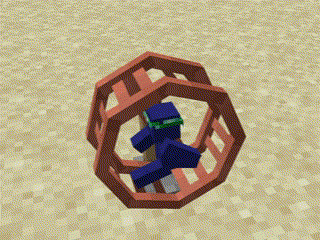

# Hamster Wheel

<ImgInfo>
  <template v-slot:img>
    <Item name="hamster_wheel"/>
  </template>
  <template v-slot:info>
    Allows Clay Soldiers to run forever, and use all their excess energy.
  </template>
</ImgInfo>

Clay Soldier can be ordered to run in the wheel with a [Clay Brush](./clay-brush.md#clay_brush_poi).
Set the Clay Brush to POI Mode, Left-click the Hamster Wheel with Brush, then Right-click the Clay Soldier.
::: info
Soldiers need to be [loyal](../clay-soldiers.md#gaining-loyalty-from-a-team) to Player in ordere to use the Hamster Wheel.
:::

## Generating Power

By using a Redstone on the Wheel it gains the Ability to generate power.

## Obtaining

::: details Recipies
<recipe-crafting
slot_2="copper_ingot"
slot_4="copper_ingot" slot_5="stick" slot_6="copper_ingot"
slot_7="stone" slot_8="copper_ingot" slot_9="stone"  
result="hamster_wheel"/>
:::