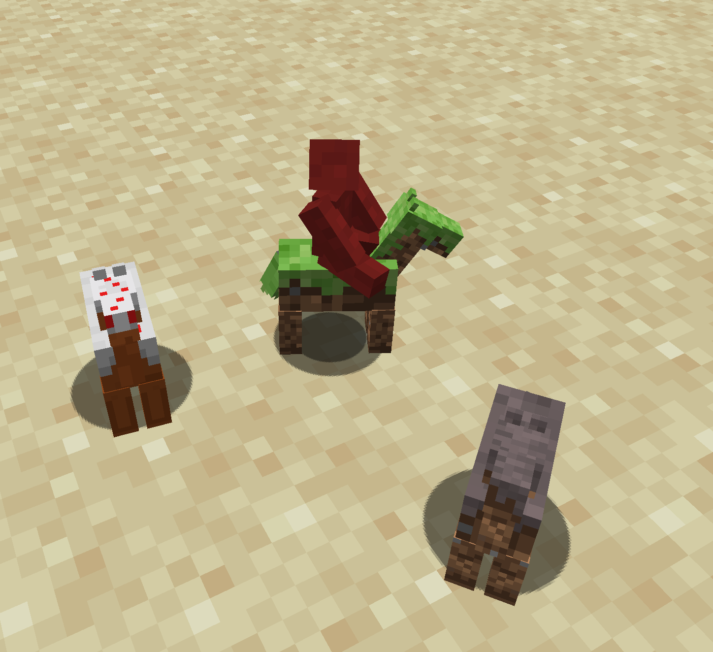
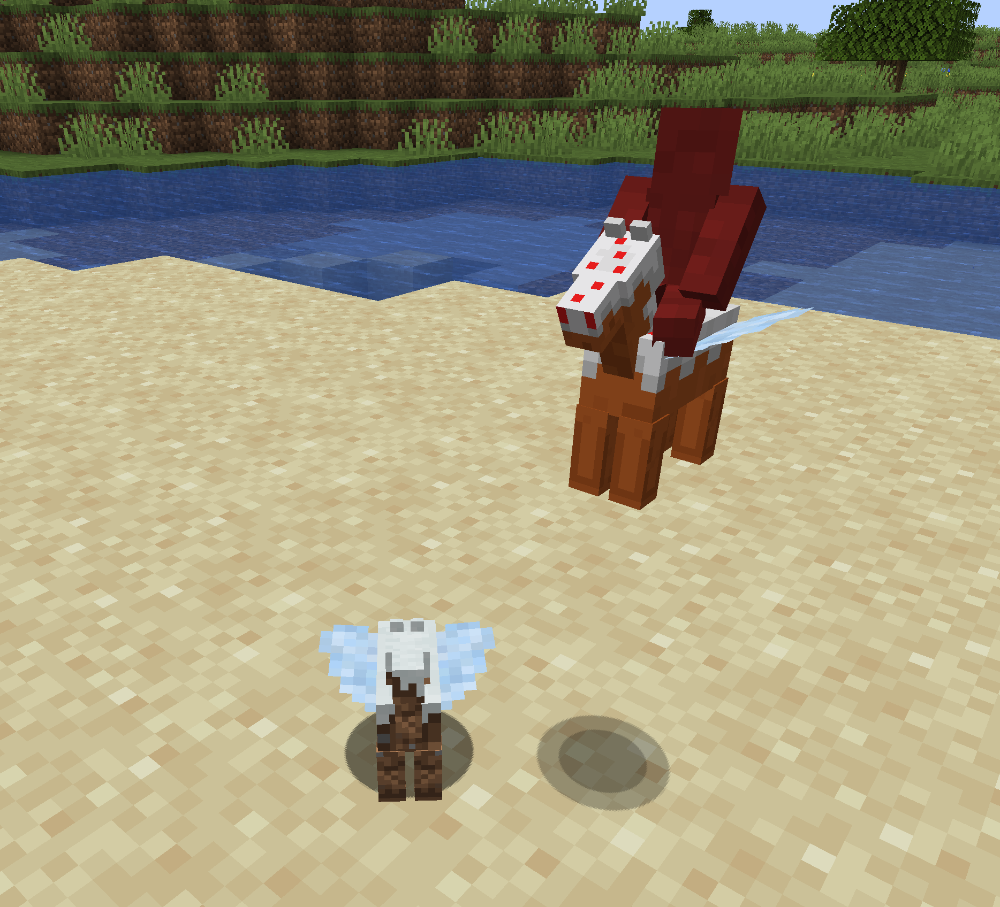
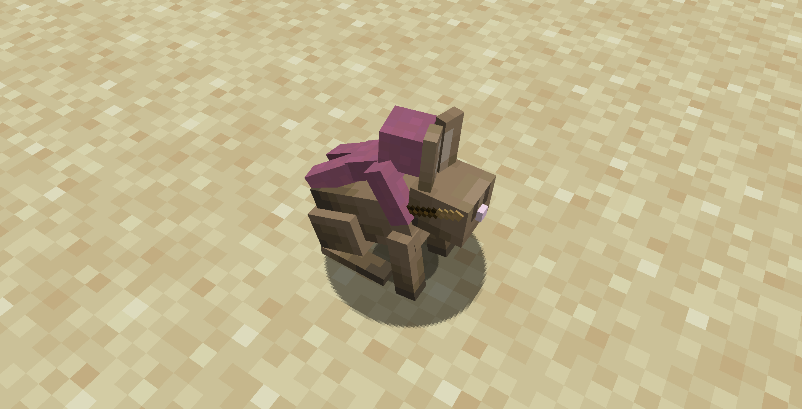

# Mounts

Mounts are creatures that Clay Soldiers can ride,
giving them increased mobility and additional advantages in battle.

## Clay Horse

Clay Horses serve as loyal mounts for Clay Soldiers,
allowing them to ride into battle with increased speed.
There are 4 different variants of Horse, Cake, Grass, Snow and Mycelium.
They can be equipped with special [armor](default-items.md#items-for-clay-horse) to provide additional protection.

## Clay Pegasus

Similar to Clay Horses, Clay Pegasi offer the same mobility on the ground,
but with the added ability to fly.
This makes them perfect for aerial combat and gaining a tactical advantage from the skies.

## Rabbits

Clay Soldiers can also ride standard Minecraft rabbits, using them as swift mounts to lead
or engage in battle. Rabbits provide speed and agility,
making them a great option for quickly moving soldiers across the battlefield.

## Endermite

When mounted, Endermites grant Clay Soldiers teleportation,
allowing them to blink instantly to new positions—ideal for surprising enemies or dodging incoming attacks.

## Small Slime

Small Slimes act as sturdy, elevated platforms. Ranged Clay Soldiers can perch atop them for extra height and cover,
launching projectiles safely from a secure vantage point.

## Turtle

Turtles make excellent aquatic mounts. Provide reliable mobility in water,
letting Clay Soldiers engage foes or navigate waterways with confidence.

## Clay Soldiers

Clay Soldiers can clamber onto larger comrades,
forming living towers. This maneuver elevates ranged fighters,
keeping them out of harm’s way while they rain down attacks.
