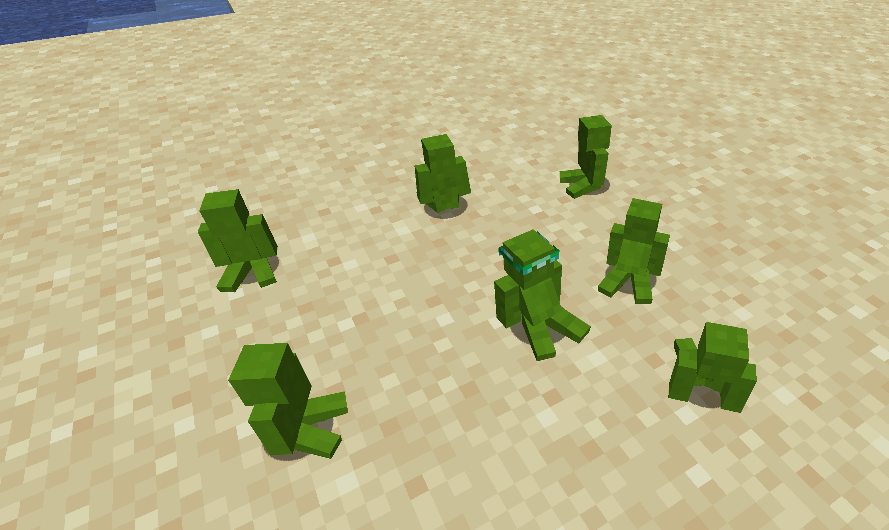
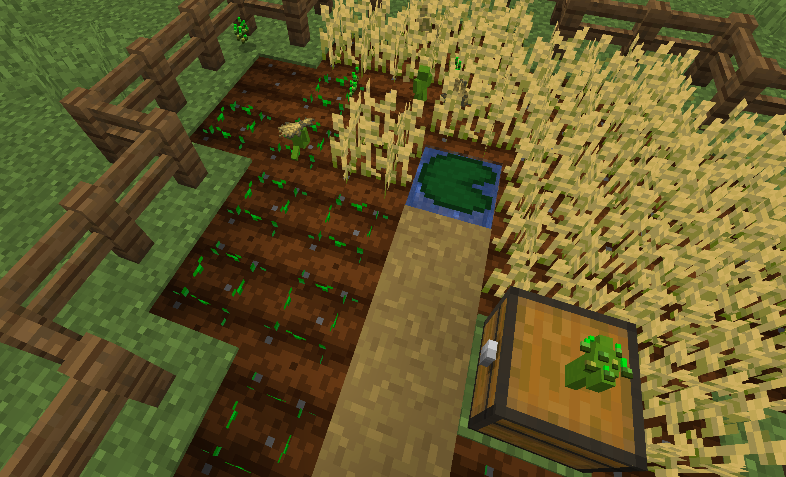
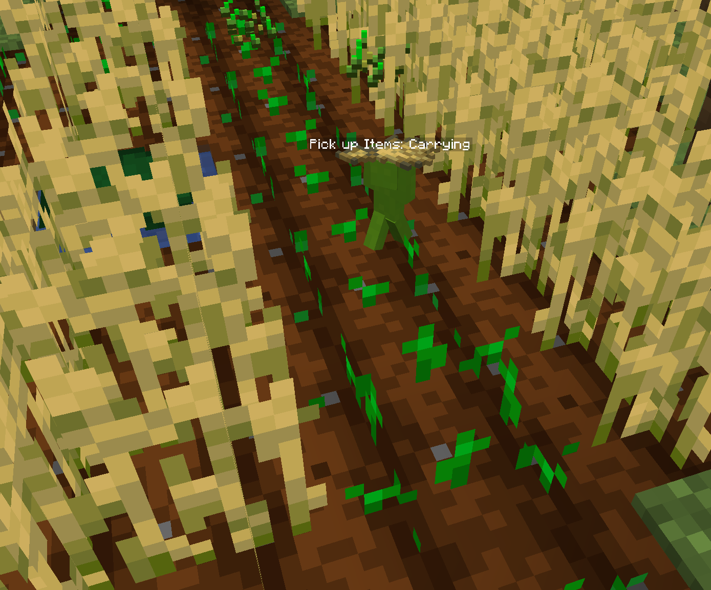

# Making Clay Soldiers Work

To have Clay Soldiers perform tasks for you, they must first be [loyal](clay-soldiers#gaining-loyalty-from-a-team) to you.
Once loyal, you can command them using the [Clay Brush](./items/clay-brush.md),
a versatile tool that lets you assign tasks and manage their behavior.

## Commanding Soldiers with the Clay Brush

The Clay Brush has multiple modes that let you control your soldiers.
Right-clicking in the air or on a Block will cycle between the available modes.

* **Command Mode:**
  * When the Clay Brush is set to `Command` mode,
  right-clicking on a soldier will make it sit and wait for further instructions.
  * If you click on a King or Queen Soldier, all nearby soldiers will sit as well,
  allowing you to halt a group at once.
  
  Clay Soldiers ordered to sit.

* **POI Mode** (Point of Interest)**:**
  * In `POI` mode, left-clicking (attacking) on a block will set that location as a POI.
  Clicking in the air will clear the saved POI.
  * Right-clicking on a soldier in this mode will assign them the POI,
  which they will treat as their primary work area.
  * When Soldiers are too far way from their POI point they will return to it.
  * When Assigned to a Storage like a chest, they will equip every Item found in the Storage.
  * This only works if they are not currently working

* **Work Mode:**
  * When in `Work` mode, you can assign specific tasks to `Pacifist` soldiers by clicking on them.
  Here are the tasks they can perform:
    * **Breaking Crops:** Soldiers will harvest crops in their assigned area.
    * **Placing Seeds:** Soldiers will take seeds from the POI _(POI needs to have an Inventory)_ and replant the crops.
    * **Picking Up Items:** Soldiers will collect nearby items and deposit them into the designated POI _(POI needs to have an Inventory)_.
    * **Digging:** Soldiers will excavate a 5x5 around the assigned POI. Multiple Soldier are required to break harder materials. _(Requires Poi)_.

  
  ::: tip
  A Soldier becomes a `Pacifist` by giving them [Wheat](default-items.md#items)
  :::
  * `None Pacifist` Soldiers with a POI point will walk around the point and guard it.

## Clay Goggles

Equipping [Clay Goggles](./items/clay-goggles.md) allows you to see the task the Soldier is doing.

